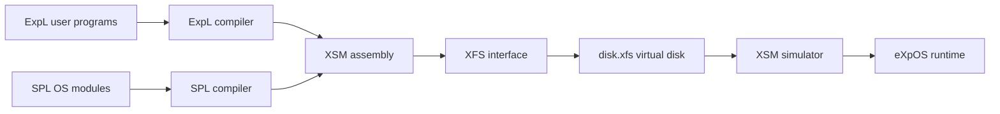

# eXpOS - Experimental Operating System

This repository contains an educational operating-system project built around
the eXpOS ecosystem:

- **XSM**: the eXperimental String Machine simulator
- **SPL**: System Programmer's Language compiler for OS modules and handlers
- **ExpL**: Experimental Language compiler for user programs
- **XFS Interface**: command-line utility for formatting and loading the
  simulated filesystem image

The project demonstrates how a small operating system is assembled from a
boot sequence, interrupt handlers, memory/process/resource managers, a virtual
disk, and user-level programs.

## Repository Layout

The repository stores the implementation as zipped stage snapshots:

| Archive | Purpose |
| --- | --- |
| `myexpos.zip` | Latest and most complete snapshot. Use this first. |
| `myexpos_till11.zip` - `myexpos_till17.zip` | Earlier milestone snapshots. |
| `myexpos_tii14.zip` | Stage-14 snapshot, with a filename typo kept from the original upload. |

After extracting `myexpos.zip`, the source tree looks like this:

```text
myexpos/
|-- Makefile
|-- expl/              # ExpL compiler, runtime library, and user programs
|-- spl/               # SPL compiler and OS-level SPL programs
|-- xfs-interface/     # XFS disk formatter / loader / file manager
|-- xsm/               # XSM machine simulator
|-- data.txt
|-- inode_table.txt
`-- sample.dat
```

## System Architecture



## What Is Implemented

The latest snapshot includes:

- XSM simulator with timer, disk, console, and debug options
- XFS disk image formatter and loader
- ExpL compiler with sample programs such as prime generation, odd/even
  printing, bubble sort, structs, idle, and init programs
- SPL compiler for kernel code
- Boot/startup code that loads OS pages and initializes process state
- Timer, disk, console, read, write, exec, and exit-related handlers
- OS modules for resource management, process management, memory management,
  device management, scheduling, and boot initialization
- XFS support for loading OS code, modules, interrupts, libraries, idle/init
  programs, data files, and executable files

## Key Components

| Component | Path after extraction | Description |
| --- | --- | --- |
| ExpL compiler | `myexpos/expl/` | Compiles `.expl` programs to `.xsm` machine code. |
| SPL compiler | `myexpos/spl/` | Compiles `.spl` OS modules and interrupt handlers to `.xsm`. |
| XFS interface | `myexpos/xfs-interface/` | Formats `disk.xfs`, loads code/data, lists files, exports files, and inspects disk blocks. |
| XSM simulator | `myexpos/xsm/` | Simulates the XSM hardware and runs the loaded OS image. |
| OS programs | `myexpos/spl/spl_progs/` | Current SPL modules, interrupt handlers, and startup code. |
| Stage 18 programs | `myexpos/spl/stage_18/`, `myexpos/spl/stage18_a/` | Additional stage-specific OS implementations. |
| User samples | `myexpos/expl/samples/` | ExpL programs used as user-level executables. |

## Prerequisites

Install the following tools:

- `gcc` or another C compiler
- `make`
- `lex` or `flex`
- `yacc` or `bison`
- `readline` development library for `xfs-interface`

On Debian/Ubuntu:

```sh
sudo apt-get update
sudo apt-get install build-essential flex bison libreadline-dev
```

On macOS with Xcode command-line tools and Homebrew:

```sh
xcode-select --install
brew install flex bison readline
```

## Getting Started

### 1. Extract the latest snapshot

```sh
unzip myexpos.zip
cd myexpos
```

### 2. Build the toolchain

On older Linux setups, the bundled makefiles may build directly:

```sh
make
```

On modern compilers, especially Apple Clang, use legacy C compatibility flags:

```sh
make CFLAGS="-g -std=gnu89 -Wno-implicit-function-declaration -Wno-int-conversion"
```

This builds:

- `expl/expl-bin` and `expl/ltranslate`
- `spl/spl`
- `xfs-interface/xfs-interface`
- `xsm/xsm`

## Compile Programs

Compile an ExpL user program:

```sh
cd expl
sh ./expl samples/prime.expl
```

This generates:

```text
expl/samples/prime.xsm
```

Compile an SPL module:

```sh
cd ../spl
./spl spl_progs/mod_0.spl
```

This generates:

```text
spl/spl_progs/mod_0.xsm
```

## Build and Load a Disk Image

The simulator expects the virtual disk at:

```text
myexpos/xfs-interface/disk.xfs
```

Run `xfs-interface` from the `xfs-interface/` directory so the disk is created
in the correct place.

Create `xfs-interface/load-os.xfs`:

```text
fdisk
load --os ../spl/spl_progs/os_startup.xsm
load --idle ../expl/expl_progs/idle.xsm
load --init ../expl/expl_progs/init.xsm
load --library ../expl/library.lib
load --int=timer ../spl/spl_progs/sample_timer.xsm
load --int=disk ../spl/spl_progs/disk_interrupt.xsm
load --int=console ../spl/spl_progs/console_interrupt.xsm
load --int=6 ../spl/spl_progs/int6.xsm
load --int=7 ../spl/spl_progs/int7.xsm
load --int=9 ../spl/spl_progs/int9.xsm
load --int=10 ../spl/spl_progs/int10.xsm
load --module 0 ../spl/spl_progs/mod_0.xsm
load --module 1 ../spl/spl_progs/mod_1.xsm
load --module 2 ../spl/spl_progs/mod_2.xsm
load --module 4 ../spl/spl_progs/mod_4.xsm
load --module 5 ../spl/spl_progs/mod_5.xsm
load --module 7 ../spl/spl_progs/mod_7.xsm
load --exec ../expl/samples/prime.xsm
ls
```

Then run:

```sh
cd xfs-interface
./xfs-interface run load-os.xfs
```

Expected output includes the formatted disk and the loaded user executable:

```text
Formatting Complete. "disk.xfs" created.
Filename: root      Filesize 512
Filename: prime.xsm Filesize 268
```

## Run the Simulator

From the `xsm/` directory:

```sh
cd ../xsm
./xsm --timer 0
```

Useful simulator options:

```sh
./xsm --timer 10
./xsm --disk 20
./xsm --console 20
./xsm --debug
```

Depending on the loaded stage image, the simulator may halt after a program
completes or remain active in the OS idle/scheduling loop.

## XFS Interface Commands

Start the interactive shell:

```sh
cd xfs-interface
./xfs-interface
```

Common commands:

| Command | Description |
| --- | --- |
| `fdisk` | Format `disk.xfs` with the XFS filesystem. |
| `run <file>` | Execute XFS commands from a script. |
| `load --os <file>` | Load OS startup code. |
| `load --int=<n> <file>` | Load an interrupt routine. |
| `load --module <n> <file>` | Load a kernel module. |
| `load --exec <file>` | Load a user executable. |
| `load --data <file>` | Load a data file. |
| `ls` | List files in XFS. |
| `cat <file>` | Print a file from XFS. |
| `copy <start> <end> <file>` | Copy disk blocks to a UNIX file. |
| `df` | Display free-list information. |
| `dump --inodeusertable` | Export inode/user-table data. |
| `dump --rootfile` | Export the root file. |

Type `help` inside the interface for the complete command list.

## OS Module Map

| File | Role |
| --- | --- |
| `os_startup.spl` | Loads idle code and boot module, initializes idle process page table and process table entry. |
| `sample_timer.spl` | Saves context, marks the current process ready, invokes scheduler, and restores the next process. |
| `disk_interrupt.spl` | Handles disk completion and wakes waiting processes. |
| `console_interrupt.spl` | Handles console input/output completion. |
| `int6.spl` | Implements terminal `Read` syscall path. |
| `int7.spl` | Implements terminal `Write` syscall path. |
| `int9.spl` | Implements `Exec`, loads executable pages, and reinitializes process resources. |
| `int10.spl` | Implements process exit/halt behavior. |
| `mod_0.spl` | Resource manager: terminal and disk acquire/release logic. |
| `mod_1.spl` | Process manager: exit, page-table cleanup, user-area cleanup. |
| `mod_2.spl` | Memory manager: free-page allocation and release. |
| `mod_4.spl` | Device manager: terminal read/write and disk load logic. |
| `mod_5.spl` | Scheduler: selects the next ready/created process and restores context. |
| `mod_7.spl` | Boot module: loads kernel/user pages and initializes system tables. |

## Development Notes

- The repository currently keeps source code inside zip archives. For easier
  review and contribution, consider extracting `myexpos.zip` into the repo root
  and committing the expanded source tree.
- Several archives include prebuilt binaries from the original environment.
  Rebuild locally instead of relying on those binaries.
- Some scripts inside the archive may not have executable permissions after
  extraction. Use `sh ./expl <file>` or run `chmod +x expl` if needed.
- `xsm/Makefile` probes `ldconfig`, which is Linux-specific. On macOS it may
  print `ldconfig: command not found`; the build can still succeed.
- `xsm/Makefile clean` uses plain `rm` for some generated files, so repeated
  `make clean` commands can fail if those files are already absent.
- If the simulator reports a NULL instruction immediately, confirm that
  `disk.xfs` was created under `xfs-interface/` and that you are running
  `xsm` from the `xsm/` directory.

## Learning Outcomes

This project is useful for understanding:

- How a tiny OS boots on simulated hardware
- How user programs are compiled into machine code
- How kernel modules and interrupt handlers are loaded into disk blocks
- How process tables, page tables, memory free lists, and resource tables work
- How timer-driven scheduling and blocking I/O are modeled
- How a filesystem interface can bridge host files and a simulated disk
